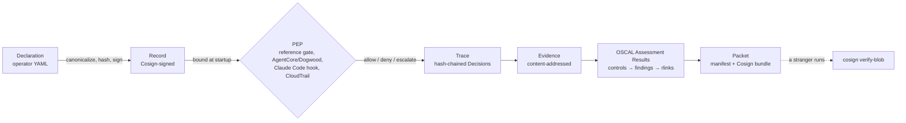

# Colophon

[](https://github.com/joseruiz1571/colophon/actions/workflows/ci.yml)

**Colophon emits a signed session packet: operator Declaration → signed Record → Decisions from a policy enforcement point (the reference MCP gate or a foreign adapter) → hash-chained Trace → content-addressed Evidence → control findings as OSCAL Assessment Results → Sigstore/Cosign-signed bundle a stranger can verify with only the directory and a public key.**

The gate is the reference microphone. The packet is the product.



New here? [`SHOW.md`](SHOW.md) is the three-command version with the live AgentCore packet. [`docs/walkthrough.md`](docs/walkthrough.md) follows one refusal through all six artifacts.

> **Custody is provable. Judgment is not.**
>
> **AgentCore/Dogwood enforce; Colophon makes the decisions portable evidence.**

## Who this is for

Two headlines the sealed packet is meant to make unmistakable:

1. **Signed artifact for agent rules of engagement** — especially AI red-team scope assurance. The declared allow/deny boundary (which tools, which Dogwood policy set, ENFORCE vs LOG_ONLY) as a reconstructible, Cosign-signed packet.
2. **Coding-agent evidence of controls** — what tools were declared, what the PEP allowed or denied, portable for audit sampling and second-party assurance.

Also relevant, named without expanding scope: vendor attestations; audit sampling of agentic tool use. Colophon is a small GRC evidence pipeline, not a rival monitoring dashboard.

On AWS, Bedrock AgentCore Gateway + Dogwood is the Policy Enforcement Point. Colophon does not reimplement Dogwood in Rego. It normalizes foreign PEP allow/deny decisions into DecisionDrafts and seals them. CloudTrail/IAM evidence stays in `packages/adapters/aws-config` — a different PEP. Captured Gateway **APPLICATION_LOGS** JSONL is an ingest path (session id from sidecar metadata). This repository does **not** ship a CloudWatch or EventBridge collector (no AWS SDK).

## Two commands

```
bun install && bun run demo
bun run colophon bundle verify out/demo/evidence-reader/bundle --pubkey out/demo/keys/cosign.pub
```

The demo needs `bun`, `opa`, `cosign` (3.x), and `jq` on the path. It runs offline after install: two declared agents are gated through the MCP gate, a Claude Code session is gated through the PreToolUse hook (one process per call) and sealed, four foreign PEP fixtures (a Claude Code hook log, a CloudTrail export, an AgentCore/Dogwood AuthorizeAction RoE replay, and a live AgentCore Gateway APPLICATION_LOGS capture) are normalized, and seven packets are signed with a throwaway local key pair and verified. Alongside each packet it writes GRC Eng Club Finding JSON (same decisions, club-readable). It exits 1 if signing fails. It prints `SIGNATURE: <path>` only after `bundle verify` passed.

Community AgentCore demo (fixture → sealed packet → verify), including the live APPLICATION_LOGS RoE capture:

```
bun run demo
bun packages/cli/main.ts bundle verify out/demo/agentcore-dogwood/bundle --pubkey out/demo/keys/cosign.pub
bun packages/cli/main.ts bundle verify out/demo/agentcore-dogwood-live/bundle --pubkey out/demo/keys/cosign.pub
bun packages/cli/main.ts export finding validate out/demo/agentcore-dogwood-live/findings/*.finding.json
```

Trace-only ingest (same `normalize` pattern as `claude-hook`). AuthorizeAction replay:

```
bun packages/cli/main.ts normalize agentcore-dogwood \
  packages/fixtures/agentcore-dogwood/session.jsonl --out out/probe/ac
bun packages/cli/main.ts trace verify out/probe/ac/trace/*.jsonl
```

APPLICATION_LOGS capture (session id from sidecar `<stem>.meta.json`, not the log body):

```
bun packages/cli/main.ts normalize agentcore-dogwood \
  packages/fixtures/agentcore-dogwood/live-roe-7461903f.jsonl --out out/probe/ac-live
bun packages/cli/main.ts trace verify out/probe/ac-live/trace/*.jsonl
# equivalent: --meta live-roe-7461903f.meta.json or --session <id>
```

A stranger with `cosign` alone:

```
cosign verify-blob --key out/demo/keys/cosign.pub \
  --bundle out/demo/evidence-reader/bundle/manifest.sigstore.json \
  --insecure-ignore-tlog out/demo/evidence-reader/bundle/manifest.json
```

(`--insecure-ignore-tlog` because the local demo signs offline with no transparency-log entry. CI signs keyless against the public Sigstore instance and verifies with a pinned certificate identity and issuer; no flag there.)

## Colophon for Claude Code

Declare it, run it, seal it, hand it to a stranger. Colophon runs as a Claude Code PreToolUse hook: the same `gate.rego` verdict path as the reference gate, one process per tool call.

```
bun packages/cli/main.ts record build packages/fixtures/declarations/claude-coder.yaml --out out/hook
bun packages/cli/main.ts record sign out/hook/claude-coder.record.json --key out/demo/keys/cosign.key --password colophon-demo
bun packages/cli/main.ts hook settings --record out/hook/claude-coder.record.json --pubkey out/demo/keys/cosign.pub --trace-dir out/hook/trace
# paste the printed fragment into .claude/settings.json, work a session, then:
bun packages/cli/main.ts seal --session <session_id> --trace-dir out/hook/trace --record out/hook/claude-coder.record.json --pubkey out/demo/keys/cosign.pub --key out/demo/keys/cosign.key --password colophon-demo --out out/hook/packets
```

Every call binds the Record (hash, signature, lint), decides, appends one chained line to `<trace-dir>/<session_id>.jsonl`, and answers `allow`, `deny`, or `ask` (for `escalate`). Claude tool names are projected onto declared names (`Write` → `fs.write`, `Bash` → `shell.exec`, `WebFetch` → `net.fetch`, `mcp__s__t` → `mcp.s.t`); paths inside the session's working directory become relative so one signed Record holds on any machine; the operator's `defaults.data_class` fills the label Claude Code never sends, recorded as the operator's. The hook rewrites nothing. It fails closed: malformed input, an unverifiable Record, or an OPA failure is a `deny`. The demo's `claude-coder` packet is produced through this path, not a replay. Full recipe and limits: [`docs/claude-code.md`](docs/claude-code.md).

## What the packet proves, and what it does not

| proves | does not prove |
|---|---|
| The signer produced these bytes (Cosign signature over the manifest). | That the signer is trustworthy or authorized. |
| No file in the bundle was altered, added, or removed after signing (manifest hashes). | That the files are complete relative to what happened outside the PEP. |
| The decisions occurred in this order and were not edited after the fact (hash chain). | That every action the agent took passed through this PEP. |
| Each refusal cites a rule and the Record field that bound it. | That the policy is the right policy. |
| Every cited evidence item exists in the store with the stated hash. | That the evidence is sufficient or the checks are the right checks. |
| The catalog checks ran deterministically over this evidence. | Correctness of any human or model judgment about the agent. |

## What is in a packet

```
bundle/
  manifest.json              every file, sha256, bytes, root hash — written last
  manifest.sigstore.json     Cosign 3 bundle over manifest.json
  records/                   the signed Record the gate bound (gate sessions)
  policy/                    the policy text the verdicts came from: gate.rego (Colophon PEP) or <id>.cedar per declared foreign policy
  trace/<session>.jsonl      hash-chained Decisions (each carries policy_sha256 when Colophon decided)
  evidence/<sha256>.json     content-addressed evidence, cited or not
  catalog/controls.yaml      the controls evaluated (stands in for an assessment plan)
  report/assessment-results.json   OSCAL 1.2.3; findings → observations → back-matter rlinks → files + hashes
  report/narrative.md        what was asked, attempted, refused, proven, not proven
  session.json
```

`colophon bundle verify` walks manifest → signature → OSCAL rlinks → files → hashes → trace chains, and with `--out` writes a second OSCAL AR for the two verify-phase controls (manifest completeness, signature) outside the bundle, because a bundle cannot attest to its own signature.

## Vocabulary

**Declaration**: operator-authored YAML, unsigned intent. **Record**: the Declaration canonicalized (RFC 8785), hashed, Cosign-signed, and bound by the gate at startup. **Decision**: one PEP-agnostic verdict (`allow` / `deny` / `escalate`, rule ids, reasons naming the binding field). **Trace**: chained Decisions. **Evidence**: content-addressed payloads. **Bundle**: the directory. **Packet**: bundle plus signature. There is no "Agent Card"; an A2A card may be cited as `identity.a2a_card_uri` and nothing more.

Optional Declaration `pep` (foreign PEP binding): when the PEP is AgentCore + Dogwood, the signed Record should name the agent/MCP tool schema ref, Dogwood policy set id + version/hash, Gateway id if known, `ENFORCE` vs `LOG_ONLY`, and `pep.policies[]`: each policy the engine held, with the hash of its statement file. See [`packages/adapters/agentcore-dogwood/README.md`](packages/adapters/agentcore-dogwood/README.md).

**The policy text is in the packet.** A Colophon PEP (gate or hook) stamps every Decision with `policy_sha256`, the hash of the `gate.rego` bytes that decided it; a foreign-PEP Record declares its policies with their hashes. The packet stages those files under `policy/`, `bundle verify` asserts every hash on its own `policy:` line, and catalog control COL-11 reports the binding (or its absence). Swap the policy after the fact and verification fails on the binding, not only on the manifest (S48, S49, D33).

## Three layers (detection vs PEP vs custody)

| layer | who | Colophon |
|---|---|---|
| Detection | CloudWatch spans, metrics, Guardrails | no |
| PEP | AgentCore Gateway + Dogwood (or the reference MCP gate, or another adapter) | no — we do not enforce |
| Custody | DecisionDraft → Trace → Evidence → OSCAL AR → Cosign | yes |

`ENFORCE` means the Gateway applied the decision. `LOG_ONLY` means Dogwood evaluated and Colophon still records the would-be allow/deny; it is not proof the call was blocked.

Finding export (`colophon export finding`) is **interop** with [GRC Eng Club](https://github.com/GRCEngClub/claude-grc-engineering) `finding.schema.json` v1. The Colophon spine remains the signed agentic receipt. CloudTrail dual-emit is deferred. See [`packages/export/finding/README.md`](packages/export/finding/README.md).

## Where this sits

The 2026 field is crowded with per-call receipt signers at the gate: Obsigna, protect-mcp, agent-custody, CertNode, Asqav, Pipelock, Quox, SealTrail, and more (the [Provenant competitor map](https://github.com/JaredKlopstein/provenant/issues/6) lists them); an IETF individual draft, [Compliance Profile of Signed Action Receipts for AI Agents](https://datatracker.ietf.org/doc/html/draft-marques-asqav-compliance-receipts-08), defines a decision-receipt profile; and [Notarized Agents](https://arxiv.org/abs/2606.04193) argues the receiver, not the agent, should sign. Colophon is not one more signer at the PEP. It is the custody and assessment layer over any PEP: it normalizes AgentCore/Dogwood, Claude Code hooks, CloudTrail, and its own gate into one Decision type, runs a control catalog with named falsifiers over the result, emits OSCAL Assessment Results whose back-matter a stranger can walk to hashed files, binds a signed rules-of-engagement Declaration to the session and re-checks executed calls against it, and reports unexercised controls as not-satisfied. None of the projects above does those five things together.

How a Colophon trace line maps onto the IETF draft's decision receipt:

| draft field | Colophon |
|---|---|
| `decision` | `Decision.effect` |
| `tool_name` | `Decision.tool` |
| `reason` | `Decision.reasons[]` (`explanation` role is the PEP's words; `binding` names the Record field) |
| `policy_digest` | `Decision.policy_sha256` (the `gate.rego` bytes, staged as `policy/gate.rego`) plus `Decision.record_sha256` for the gate and hook; `Record.pep.policies[].sha256` (each statement staged as `policy/<id>.cedar`) for a foreign PEP |
| `previousReceiptHash` | `Decision.prev_sha256` (plus the trace head commitment) |
| `payload_digest` | `Decision.args_sha256` |
| `issued_at` | `Decision.ts` |
| `issuer_id`, `key_thumbprint` | `manifest.sigstore.json` (Cosign, once per packet) |
| `action_ref`, `sandbox_state`, `iteration_id` | no equivalent; `session_id` + `call_index` are the nearest |

Where the field is ahead: per-receipt signing at decision time (Colophon signs once per packet; the trace is hash-chained but unsigned until sealed), an independent timestamp in the local path (only CI's Rekor entry today), DSSE/in-toto envelopes, and receiver-side attestation. Those are design questions, not claims.

## How this was built

Spec-first, agent-built, operator-graded. `SPEC.md` was written before the code, with a shell probe per claim. Coding agents (Cursor) wrote most of the implementation against it; eight of the commits carry that author. The operator ran the fresh-clone probe suite as the grade, commissioned an independent second look that found real bugs (D18–D23), and recorded every judgment call in `DECISIONS.md` with who made it. A later round applied three outside evaluations (D28–D31). That is the Colophon method applied to Colophon: the author field says who typed, the decisions file says who decided, the probe says whether it is true.

## Adapters

| adapter | status |
|---|---|
| `colophon-gate` | live in the demo: MCP stdio PEP, verdicts only from `packages/policy/gate.rego` via OPA |
| `colophon-hook` | live in the demo: Claude Code PreToolUse hook, same Rego verdicts, `colophon seal` at session end |
| `claude-hook` | fixture: a foreign hook's PreToolUse log → Decisions → same catalog, signed packet |
| `aws-config` | interface + fixture reader only (CloudTrail LookupEvents, GetRolePolicy, GetBucketEncryption). Infrastructure PEP. No SDK, no live client. |
| `agentcore-dogwood` | AuthorizeAction fixture replay **and** captured APPLICATION_LOGS JSONL (session id from sidecar/`--session`). No SDK, no CloudWatch client. |

## Status

Every claim, its probe, and whether the probe ran from a fresh clone: [`SPEC.md`](SPEC.md) defines them, [`STATUS.md`](STATUS.md) reports them, [`DECISIONS.md`](DECISIONS.md) records the choices made here. Nothing in this repository claims a live CloudWatch/EventBridge collector, an OWASP contribution, in-toto co-authorship, or any certification.

`package.json` is marked `private`: this is a tool you clone and run, not an npm package, and the flag blocks an accidental publish. Vulnerability reports: [`SECURITY.md`](SECURITY.md). Contributing: [`CONTRIBUTING.md`](CONTRIBUTING.md).

## License

MIT.
